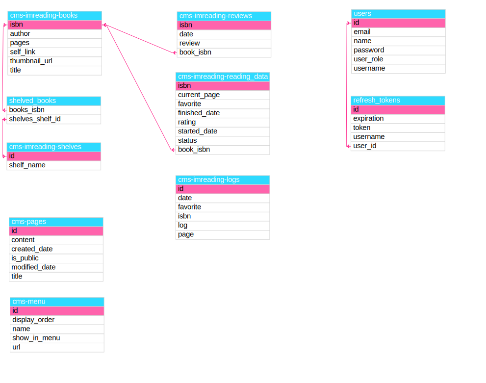

`Last revision to code was JAN 2 2024 but this document still needs to be udpated. - mm 7-1-2024`

############## = redacted for security

#  Confetti Cloud CMS API
## API Design Document

### WHAT IS THIS?
A content management system for book lovers to track their reading experience.

```txt
Version: v.1.0
Date: DEC 2023
Author: Marisabel Munoz
Email: mail@marisabel.nl
```
### 1. Introduction

### 1.1 Purpose

Since I embarked on my reading journey, I've been on the hunt for methods to track my books. I've experimented with journals, blogs, apps, and even dabbled in the realm of social media. Yet, I never found a solid fit until I started updating my Goodreads account. It was then that I realized what had been missing all along. Beyond simply cataloging books—an ability most modern apps possess—I've yearned to document my experience. I want to capture my thoughts as I read, not just after the last page is turned.

Certainly, crafting a final review holds its charm. But my true delight resides in the process itself—the raw reactions, thoughts, and ideas that emerge from the dance between my mind and the page. Perhaps this is why the present tense, "I am," resonates with me; it signifies the act unfolding in the moment. No more reading and moving on; instead, I read and relish each fragment of time.

This app is my endeavor to remain anchored in the now, to be wholly present in the act of reading. It's my way of refraining from the rush to reach the last page just to notch up another title on the list. My aspiration is to capture the essence of reading through a humble micro-blog dedicated solely to books.

This document represents my attempt to structure my thoughts, a blueprint to craft an API that can seamlessly integrate with any frontend language. (The original concept was realized through a Spring Boot Web App.) The aim is efficiency—to bring my vision to life while enabling me to cherish the unfolding journey of reading.

#### 1.2 Scope

The scope of this API design document covers the following functionalities and components of the **Confetti Cloud CMS** app:

This is a back end only application.

```txt
v.1.0 has hard coded configurations, but once I have it running for my own use I will revise the code to allow configuration of database via config file. [12-nov-2023]
```

##### 1.2.1 Book Management:

- Adding books to the user's reading list.
- Retrieving details of books, such as title, author, genre, and cover image.
- Marking books as read/unread.
- Removing books from the reading list.
- Categorize books in shelves
- Rating books after reading
- Adding dedicated review to the books
- Adding dedicated logs to the books
- Searching for the books via Google Books API

##### 1.2.2 Pages:
- Add HTML content pages to the database
- Call the pages per ID to display on the front end as needed

##### 1.2.3 Menu:
- add links to be used on navigation
- activate or deactivate the links
- add desired order of display for active links

##### 1.2.4 API Security:

- Implementing user authentication using API keys.
- Ensuring secure access to user-specific data.

#### 1.3 The following functionalities are out of scope for this API design document:

- Social sharing features.
- E-commerce features (purchasing books).
- Third-party integrations (e.g., connecting to external book databases).
- User interface details (app screens, layouts, designs).

#### 1.4 Audience

- Primarily, the document caters to my personal use.
- Additionally, it serves as a resource for my children as they embark on their reading endeavors.
- Lastly, it accommodates hypothetical users, allowing me to engage with a practical, real-world context for practice.

#### 1.5 Definitions, Acronyms, and Abbreviations

- TBR : To be read
- Reading : books in progress
- Read : books finished
- DNF : Do not finish books
- logs : journal entries

### 2. API Overview

#### 2.1 API Name

Confetti Cloud CMS

#### 2.2 API Description

provides the ability to set up a reading micro-blog to keep track of the reading experience as well as custom content pages and navigation

#### 2.3 Base URLs


   ```url
   http://localhost:5990/app/
   ```

- imReading Books module: `imreading/v1`
- Pages module: `pages/v1`
- Menu module: `menu/v1`
- Security module: `##############`


#### 2.4 Authentication and Authorization

Our API utilizes Bearer tokens for authentication and authorization purposes.

**Authentication**:

To authenticate with our API, clients are required to include their Bearer token in the request headers.
The Bearer token serves as a credential to verify the identity of the client making the request.
Without a valid Bearer token with the correct prefix, access to the API will be denied.

Clients should include the Bearer token in the Authorization header of the HTTP request.
Here's an example of how the header might look:

```vbnet
   Authorization: Bearer YOUR_TOKEN_HERE
```

##### 2.4.1 Endpoints to register and generate token:

- POST `##############`

```json
{
  "name": "string",
  "email": "string",
  "username": "string",
  "password": "string"
}
```

- POST `##############`
```json
{
"username": "string",
"password": "string"
}
```
- RESPONSE BODY:
```json
  {
  "token": "string",
  "refreshToken": "string"
  }
```
[!] The refresh token functionality is not yet fully operational. It is advisable to employ an HTTP-only cookie with a regeneration time aligned with the cookie creation.


#### 2.5 Versioning Strategy

As I work on this personal project, I understand the significance of versioning to ensure a smooth experience for users while allowing room for improvements. My versioning strategy ensures that the API remains compatible with existing integrations even as I make updates.

**Versioning Format:**

I've opted for a versioning format within the URL to provide clarity regarding the API version being utilized. The version number is incorporated as a segment in the URL path. Therefore, the base URL for the API includes the version number as illustrated below:

```url
 http://localhost:5990/app/MODULE/v2
```
To maintain a streamlined experience and allow clients to focus on individual modules if preferred, I've deliberately kept the modules separate.

**Versioning Changes:**

My goal is to maintain backward compatibility whenever feasible. This means that minor enhancements and updates within a version won't disrupt existing integrations. However, as the project evolves, there might be instances where changes could potentially affect compatibility.

In such scenarios, I'll create a new version of the API. Significant changes that might not be backward compatible will lead to a new version number. For instance, if I introduce new endpoints, make substantial changes to the response structure, or modify behaviors that could impact existing integrations, I'll increment the version number in the URL.

**Handling Deprecated Versions:**

When a new version of the API is introduced, the previous version(s) will still be accessible during a transition period. I'll provide adequate notice and documentation to assist users in transitioning to the latest version.

**Example:**

Let's say you've been using version 1 of the API, and I release version 2. You'll be able to access version 1 at `http://localhost:5990/app/MODULE/v1` for a designated time while transitioning to version 2, available at ` http://localhost:5990/app/MODULE/v2/`.


## imReading API

### Search API

- GET  `/app/imreading/v1/search?QUERY`

#### reponse body
```json
[
  {
    "title": "string",
    "author": "string",
    "isbn": "string",
    "thumbnailUrl": "string",
    "pages": 0,
    "selfLink": "string",
    "shelves": [
      "string"
    ]
  }
]
```

### Books | id = string (isbn)
`/app/imreading/v1/books`

- GET `/{isbn}`
- PUT `/{isbn}`
- DELETE `/{isbn}`
- GET `/`
- POST `/`

#### body
```json
{
  "isbn": "string",
  "title": "string",
  "author": "string",
  "pages": 0,
  "thumbnailUrl": "string",
  "selfLink": "string",
  "shelves": [
    0
  ],
  "readingData": {
    "bookIsbn": "string",
    "startedDate": "2023-11-12T18:19:27.019Z",
    "finishedDate": "2023-11-12T18:19:27.019Z",
    "status": "string",
    "currentPage": 0,
    "rating": 0,
    "favorite": true
  },
  "reviews": {
    "bookIsbn": "string",
    "date": "2023-11-12T18:19:27.019Z",
    "review": "string"
  }
}
```

### reading logs | id = 1L
`/app/imreading/v1/logs`

- POST `/`
- PUT `/{id}`
- GET `/{isbn}`
- GET `/` - all
- GET `/log/{id}`
- DELETE `/delete/{isbn}`
- DELETE `/delete/{id}`

#### body
```json
{
  "isbn": "string",
  "date": "2023-11-12T18:21:29.049Z",
  "page": 0,
  "favorite": true,
  "log": "string"
}
```
### book reviews | id = string (isbn)
`/app/imreading/v1/reviews`

- POST `/{isbn}`
- PUT `/{isbn}`
- GET `/all`
- GET `/{isbn}`
- DELETE `/{isbn}`

#### body
```json
{
  "bookIsbn": "string",
  "date": "2023-11-12T18:23:21.061Z",
  "review": "string"
}
```

### reading data | id = string (isbn)
`/app/imreading/v1/reading`

- POST `/`
- PUT `/{isbn}`
- GET `/{isbn}`
- DELETE `/{isbn}`

#### body
```json
{
  "bookIsbn": "string",
  "startedDate": "2023-11-12T18:24:07.328Z",
  "finishedDate": "2023-11-12T18:24:07.328Z",
  "status": "string",
  "currentPage": 0,
  "rating": 0,
  "favorite": true
}
```

### shelves | id = 1L
`/app/imreading/v1/shelves`

- POST
- PUT `/{id}`
- GET
- GET `/{name}`
- GET `/shelf/{id}`
- DELETE `/{name}`

#### body
```json
{
  "id": 0,
  "shelfName": "string"
}
```

### shelves | id = 1L
`/app/imreading/v1/shelves`

- POST `/`
- PUT `{id}`
- GET `/`
- GET `/{name}`
- DELETE `/{name}`

#### body
```json
{
  "id": 0,
  "shelfName": "string"
}
```


## Pages API

### pages | id = 1L
`/app/pages/v1/`

- POST `/`
- PUT `/{id}`
- GET `/{id}`
- GET `/`
- DELETE `/{id}`

#### body
```json
{
  "id": 0,
  "title": "string",
  "createdDate": "2023-11-12T18:27:13.210Z",
  "modifiedDate": "2023-11-12T18:27:13.210Z",
  "content": "string",
  "public": true
}
```
[!] For PUT, remove created date or it will overwrite!

```json
{
  "title": "string",
  "modifiedDate": "2023-10-09T13:42:00.562Z",
  "content": "string",
  "public": true
}
```

## Menu API (links)


### links | id = 1L
`/app/menu/v1/`

- POST `/`
- PUT `/{id}`
- GET `/{id}`
- GET `/all`
- GET `/active`
- DELETE `/{id}`

#### body
```json
{
  "id": 0,
  "name": "string",
  "url": "string",
  "displayOrder": 0,
  "showInMenu": true
}
```


### 4. Data Models
Database Design


